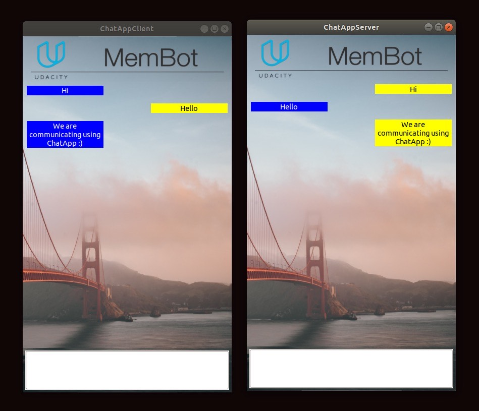

# CPPND: Networking protocol ChatApp

This is the Capstone project for the [Udacity C++ Nanodegree Program](https://www.udacity.com/course/c-plus-plus-nanodegree--nd213): ChatApp

This project consists of 2 applications: ChatAppClient and ChatAppServer. Using the network protocol TCP and WxWidgets, the ChatApp creates a GUI where client and server applications can communicate via messages.

This project implements almost all the concepts covered in this nanodegree.

## Dependencies for Running Locally
* cmake >= 3.11
  * All OSes: [click here for installation instructions](https://cmake.org/install/)
* make >= 4.1 (Linux, Mac), 3.81 (Windows)
  * Linux: make is installed by default on most Linux distros
  * Mac: [install Xcode command line tools to get make](https://developer.apple.com/xcode/features/)
  * Windows: [Click here for installation instructions](http://gnuwin32.sourceforge.net/packages/make.htm)
* gcc/g++ >= 5.4
  * Linux: gcc / g++ is installed by default on most Linux distros
  * Mac: same deal as make - [install Xcode command line tools](https://developer.apple.com/xcode/features/)
  * Windows: recommend using [MinGW](http://www.mingw.org/)
* wxWidgets >= 3.0
  * Linux: `sudo apt-get install libwxgtk3.0-dev libwxgtk3.0-0v5-dbg`
  * Mac: There is a [homebrew installation available](https://formulae.brew.sh/formula/wxmac).
  * Installation instructions can be found [here](https://wiki.wxwidgets.org/Install). Some version numbers may need to be changed in instructions to install v3.0 or greater.

## Basic Build Instructions

1. Clone this repo.
2. Make a build directory in the top level directory: `mkdir build && cd build` in both server and client applications.
3. Compile: `cmake .. && make` in both applications.
4. Run server: `./ChatAppServer` for server.
5. Run client: `./ChatAppClient 127.0.0.1`for client. Please ensure to compile and run server before client.

## Rubric points satisfied:

## Loops, Functions, I/O:
1. The project demonstrates an understanding of C++ functions and control structures in all the files.

## Object Oriented Programming:
2. The project uses Object Oriented Programming techniques.
-The project code is organized into classes with class attributes to hold the data, and class methods to perform tasks.

3. Classes use appropriate access specifiers for class members.
-All class data members are explicitly specified as public, protected, or private.

4. Class constructor utilizes member initialization lists.
-Lines 175-176, 259-260 in chatgui.cpp file of ServerApp(ChatApp/ServerApp/src/chatgui.cpp)
-Lines 173-174, 252,253 in chatgui.cpp file of ClientApp(ChatApp/ClientApp/src/chatgui.cpp)

5. Classes abstract implementation details from their interfaces.
-Socket implementation is hidden from the user.

6. Classes encapsulate behavior.
-Appropriate data and functions are grouped into classes. For example, SimpleTCPServerSocket class (ChatApp/ServerApp/src/server.cpp) consists of all the functions related to server socket and similarly client functions are included in SimpleTCPClientSocket class.

7. Classes follow an appropriate inheritance hierarchy.
-In this project, SimpleTCPSocket is the parent class, SimpleTCPServerSocket and SimpleTCPClientSocket are the child classes.
-Socket functions send() and receive() are included in the parent class since the child classes can extend these functions.

## Memory Management:
8. The project makes use of references in function declarations.
-Line30 send() function and line 36 recv() function present in socket.cpp of both the applications.(ChatApp/ServerApp/src/socket.cpp)
-Line6 in client.cpp of ClientApp.(ChatApp/ClientApp/src/client.cpp)

9. The project uses destructors appropriately.
-Line6 Destructor of class SimpleTCPSocket closes the socket gracefully in both the applications.(ChatApp/ServerApp/src/socket.cpp)
-Line194 Destructor of class ChatBotPanelDialog closes the receiving thread gracefully. (ChatApp/ClientApp/src/chatgui.cpp)

10. The project uses smart pointers instead of raw pointers.
-Line26 _serverSocket is a unique pointer used of type SimpleTCPServerSocket.(ChatApp/ServerApp/src/chatgui.h)
-Line25 _clientSocket is a unique pointer used of type SimpleTCPClientSocket.(ChatApp/ClientApp/src/chatgui.h)

## Concurrency:
11. The project uses multithreading.
-In chatgui.cpp of both the applications, a ReceivingThread function is executed in a different thread.(Line197 ChatApp/ServerApp/src/chatgui.cpp)

12. A mutex or lock is used in the project.
-Line139 A lock guard is used before pushing the message into queue.(ChatApp/ServerApp/src/chatgui.cpp)
-Line159 A lockguard is used before popping the message from the queue.(ChatApp/ServerApp/src/chatgui.cpp)
-Similarly in ClientApp in lines 138 and 158.(ChatApp/ClientApp/src/chatgui.cpp)

